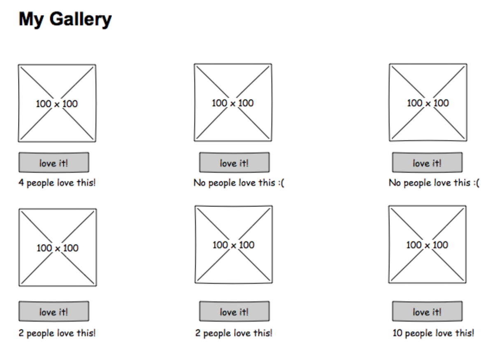

# Instructions

Welcome!

This application challenge is intended to give you a chance to demonstrate your ability to review programming code and to provide accuate and useful feedback to the coder.

This is an actual weekend assignment given to students in the program and as such, it is intentionally focused on ReactJS and not expected to be a production-ready application.


## What To Do

Your goal is to download the project, get it started up and see how it is functioning. From there, look through the code and provide no more than three paragraphs of feedback. Your feedback should contain both positive feedback and areas of improvement. 

One of the core tenants of staff and student interaction here at Prime is that the student walks away with clear, actionable feedback that makes them feel empowered to make positive change. 

You may assume this student’s name is Kris.

## Challenge Submission

Email your contact when you have finished.

---

## Student Instructions

This is what the students were given.

### React - Gallery of My Life

This is a React-based application with a minimal REST server. The application should be implemented to the following specifications.

### Setup

There is no database component to base mode. All data is stored in an array on the server. Before you get started, add a few images to the `public/images` folder and modify the `server/modules/data.js` to include an `id`, `title`, `description` and `path for` each of your images. Each `id` should be a unique number (e.g. 1, 2, 3...).

Running the server code requires `nodemon`. If you don't already have `nodemon`, install it globally with `npm install nodemon --global`.

```
npm install
npm run server
```

Now that the server is running, open a new terminal tab with `cmd + t` and start the react client app.

```
npm run client
```

Between the server and client, you'll need two terminal tabs! Because we're using `nodemon`, both our client side and server side will automatically spin back up when changes are made!

## REQUIRED FEATURES

- Use `axios` to retrieve (`GET`) data from to `/gallery` and store it in `App.js`.
- Create a new **component** for the `GalleryList`.
- Create a new **component** called `GalleryItem.js` and pass it the individual gallery items via `props`. 
- Display all of the images on the screen.
- Swap the image with the description on click.
- Display the number likes for each item and include a like button.
- When the like button is clicked, use `Axios` to update (`PUT`) the like count `/gallery/like/:id`.
- Update the gallery each time a like button is clicked.

### Wireframes

> NOTE: Images don't need to be 100px x 100px but it will be easier if the are all the same dimensions.




